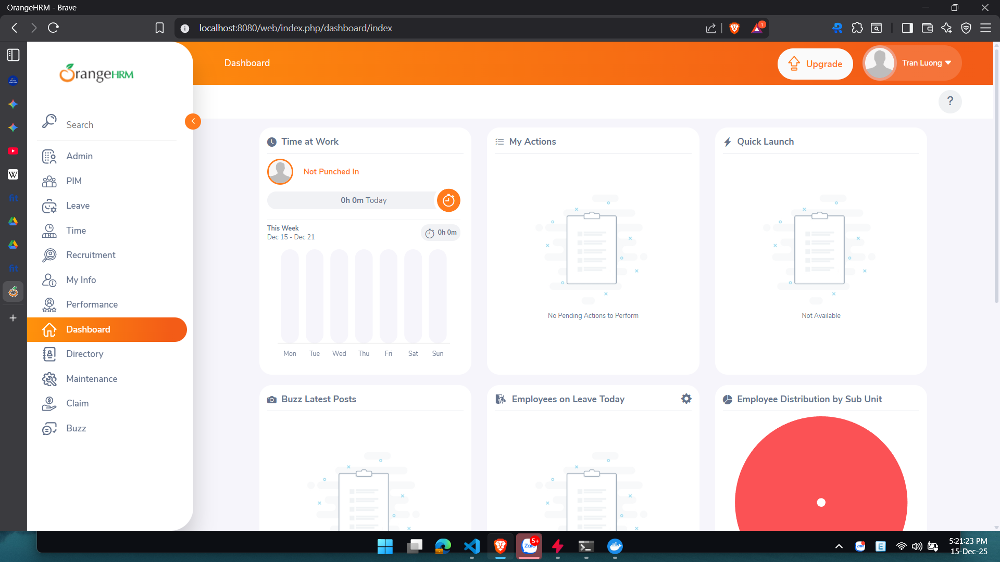

# OrangeHRM trên Docker

```docker-compose up -d``` to start the OrangeHRM application.

### Truy cập OrangeHRM tại http://localhost:8080

### 1. Chọn Fresh Installation

### 2. Accept License Agreement

### 3. Điền thông tin Database:

    - Database Host Name: db
    - Database Name: orangehrm
    - Database User: orangehrm
    - Database Password: orangehrm
    - Database Port: 3306

### 4. Check ok

### 5. Điền thông tin

    - Organization Name: Nhom2
    - Contry: Vietnam
    - Time Zone: Asia/Ho_Chi_Minh ### IMPORTANT Time and Attendance (Chấm công).

### 6. Tạo tài khoản Admin

    - Username: admin
    - Password: Admin@12345

### 7. Hoàn tất cài đặt và đăng nhập với tài khoản Admin vừa tạo

Lưu ý: Nếu gặp lỗi kết nối database, hãy chắc chắn rằng container database đã chạy và thông tin kết nối đúng

### 8. Enjoy OrangeHRM!


