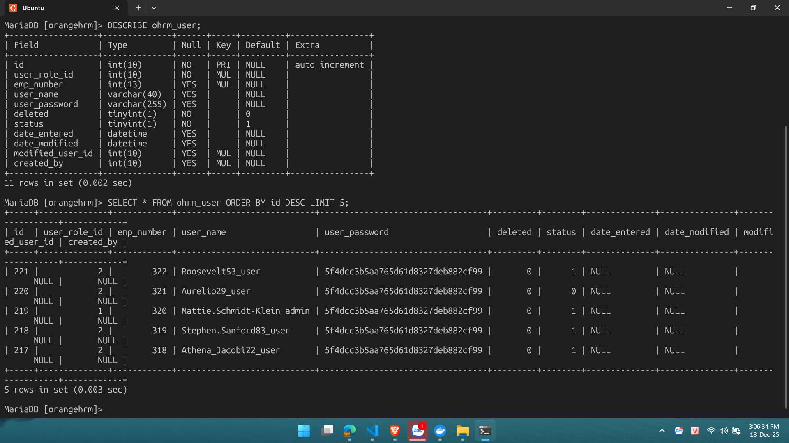
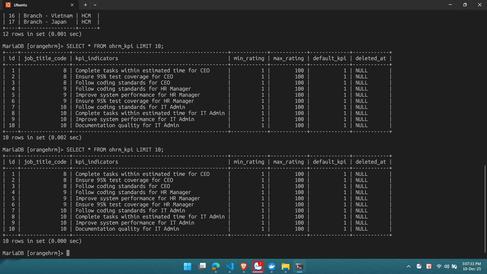

# Hướng Dẫn Kiểm Tra Database OrangeHRM (Project Case Study)

Tài liệu hướng dẫn truy cập và kiểm tra dữ liệu trong MariaDB của OrangeHRM thông qua Docker.

## Thông tin cấu hình
* **Container Name:** `orangehrm_db`
* **Database User:** `root`
* **Database Password:** `root`
* **Database Name:** `orangehrm`

---

## Cách 1: Kiểm tra nhanh (Copy & Paste)
Sử dụng các lệnh này tại Terminal/CMD để xem dữ liệu ngay lập tức mà không cần đăng nhập vào trong.

### 1. Xem danh sách tất cả các bảng (Tables)
```bash
docker exec -it orangehrm_db mysql -u root -proot -e "USE orangehrm; SHOW TABLES;"

```

### 2. Xem cấu trúc bảng User (Admin Module)

```bash
docker exec -it orangehrm_db mysql -u root -proot -e "USE orangehrm; DESCRIBE ohrm_user;"

```

### 3. Xem cấu trúc bảng KPI (Performance Module)

```bash
docker exec -it orangehrm_db mysql -u root -proot -e "USE orangehrm; DESCRIBE ohrm_kpi;"

```

### 4. Xem 5 dòng dữ liệu mới nhất của bảng User

```bash
docker exec -it orangehrm_db mysql -u root -proot -e "USE orangehrm; SELECT id, user_name, user_role_id, status FROM ohrm_user ORDER BY id DESC LIMIT 5;"

```

---

## Cách 2: Truy cập Interactive Shell (Chi tiết)

Sử dụng cách này khi muốn gõ nhiều lệnh SQL liên tục để soi dữ liệu.

### Bước 1: Đăng nhập vào MariaDB Container

Chạy lệnh sau:

```bash
docker exec -it orangehrm_db mysql -u root -proot
```

*(Nếu thành công, dấu nhắc lệnh sẽ chuyển thành `MariaDB [(none)]>`)*


### Bước 2: Chọn Database

```sql
USE orangehrm;
```

*(Dấu nhắc lệnh chuyển thành `MariaDB [orangehrm]>`)*

#### Xem các bảng trong database

```sql
SHOW TABLES IN orangehrm; 
```
or
```sql
USE orangehrm; 
SHOW TABLES;
```

### Bước 3: Các lệnh kiểm tra quan trọng cho Đồ án

Dưới đây là các bảng quan trọng tương ứng với các module bạn chọn:

#### 1. Module Admin (User Management)

Kiểm tra xem script đã tạo đúng User, Job Title và Location chưa.

* **Bảng Người dùng hệ thống:**
```sql
DESCRIBE ohrm_user;
SELECT * FROM ohrm_user ORDER BY id DESC LIMIT 5;
```

* **Bảng Chức danh (Job Titles):**
```sql
DESCRIBE ohrm_job_title;
SELECT id, job_title FROM ohrm_job_title;
```


#### 2. Module Performance (KPIs)

Kiểm tra xem script đã gán KPI cho Job Title chưa.

* **Bảng KPI:**
```sql
DESCRIBE ohrm_kpi;
SELECT * FROM ohrm_kpi LIMIT 10;

```


### Bước 4: Thoát

```sql
EXIT;
```
